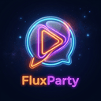

<br/>
<p align="center">
  
  <h1 align="center">FluxParty</h1>
  <p align="center">
    <strong>A stunning, glassmorphic watch party extension that syncs Netflix perfectly.</strong>
    <br/>
    <br/>
    <a href="https://watch-party-bice-zeta.vercel.app/">View the Web App</a>
    ·
    <a href="https://github.com/sumitpaul7june/watch-party/issues">Report Bug</a>
    ·
    <a href="https://github.com/sumitpaul7june/watch-party/issues">Request Feature</a>
  </p>
</p>

---

## 🍿 About The Project

FluxParty is the ultimate way to watch Netflix together with your friends. 
Unlike clunky watch party extensions, FluxParty is built with a sleek, modern, glassmorphic design system and features an ultra-low latency WebSocket architecture.

It consists of three main parts:
1. **The Backend Server:** A blazing fast Node.js/Socket.io server deployed on Render that handles real-time synchronization and chat broadcasting.
2. **The Web App:** A beautiful React + Vite landing page deployed on Vercel where users can create rooms and chat from the web.
3. **The Chrome Extension:** A Manifest V3 Chrome Extension that injects a seamless glassmorphic chat sidebar directly into the Netflix player, perfectly synchronizing video state (Play, Pause, Seek).

### ✨ Features
* **Flawless Video Sync:** If anyone in the room pauses, plays, or scrubs the timeline, it instantly synchronizes for everyone else.
* **Auto-Join Links:** Simply share your room code URL with a friend, and they will automatically join the room the moment they open Netflix.
* **Beautiful Live Chat:** Chat in real-time with an elegant UI that slides perfectly into the side of your Netflix window without interrupting the movie.
* **Zero Registration:** Generate a guest session instantly, complete with a randomized robotic avatar.

### 🛠️ Built With

* [![React][React.js]][React-url]
* [![Node.js][Node.js]][Node-url]
* [![Socket.io][Socket.io]][Socket-url]
* [![PostgreSQL][PostgreSQL]][Postgres-url]
* **Chrome Extension API (Manifest V3)**

---

## 🚀 Getting Started

If you want to run FluxParty locally for development, follow these steps:

### Prerequisites
* [Node.js](https://nodejs.org/) installed on your machine.

### 1. Start the Backend Server
```bash
cd backend
npm install
npm start # or npm run dev for nodemon
```
*The backend runs on port 8080 by default.*

### 2. Start the Frontend Web App
```bash
cd frontend
npm install
npm run dev
```

### 3. Load the Chrome Extension
1. Open Google Chrome and navigate to `chrome://extensions/`.
2. Toggle **Developer mode** in the top right corner.
3. Click **Load unpacked** in the top left corner.
4. Select the `chrome-extension` folder inside this repository.

---

## 🎨 Architecture & Design

FluxParty takes pride in its aesthetics. Both the Web App and the Chrome Extension use a shared design language featuring:
* Deep space-blue gradients (`#1e1b4b` to `#0f172a`)
* Translucent glassmorphism containers (`rgba(255, 255, 255, 0.05)`)
* High-contrast, glowing accents and neon borders
* Identical chat UI systems across both the React frontend and the vanilla JS extension sidebar.


<!-- Markdown Links & Images -->
[React.js]: https://img.shields.io/badge/React-20232A?style=for-the-badge&logo=react&logoColor=61DAFB
[React-url]: https://reactjs.org/
[Node.js]: https://img.shields.io/badge/Node.js-43853D?style=for-the-badge&logo=node.js&logoColor=white
[Node-url]: https://nodejs.org/
[Socket.io]: https://img.shields.io/badge/Socket.io-black?style=for-the-badge&logo=socket.io&badgeColor=010101
[Socket-url]: https://socket.io/
[PostgreSQL]: https://img.shields.io/badge/PostgreSQL-316192?style=for-the-badge&logo=postgresql&logoColor=white
[Postgres-url]: https://www.postgresql.org/
